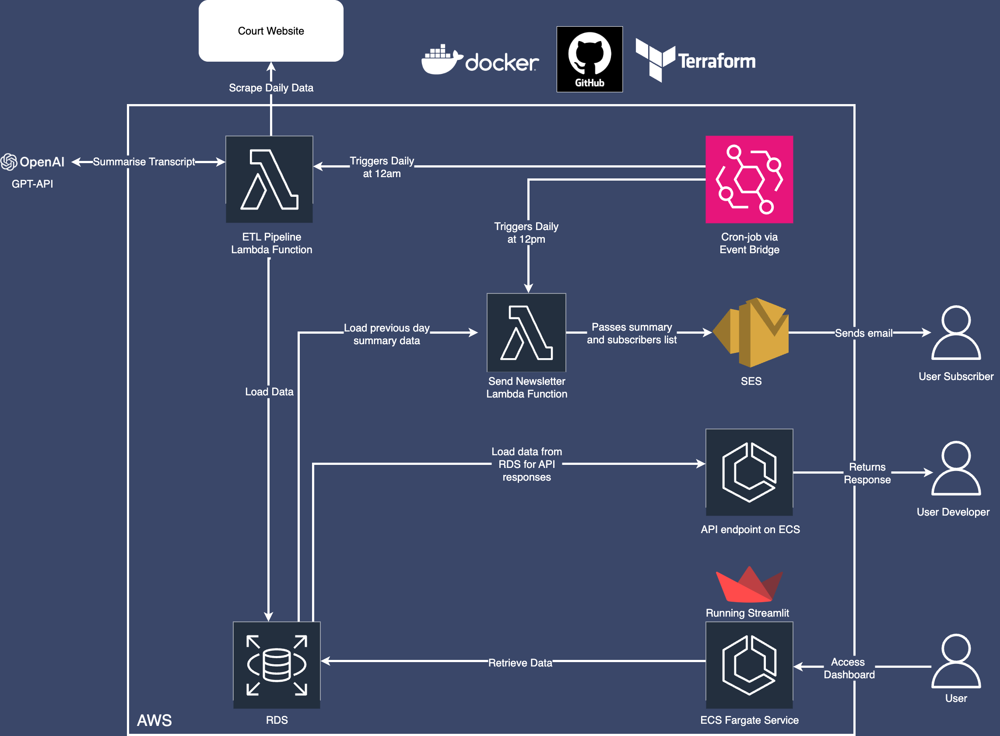

# 🏛️ Court Transcript Pipeline

The National Archives release transcripts of real court hearings every day. They are given in plain text on the [NA website](https://caselaw.nationalarchives.gov.uk/).

These transcripts are released more frequently than a person could read them and are often hard to consume for the average person. Additionally, it is hard to search through this data so you can research further. For example:

- How many cases has a judge sat? 
- How often do they rule one way or another?
- Do specific judges have bias?

Overall, the problem is that the public does not have sufficient access or knowledge of what happens inside courtrooms and the people who have traditionally solved this problem (journalists) are currently in massive decline because of wider market reasons. This tool can help the public to properly understand court judgements and also streamline the process of journalists communicating court proceedings with the public.

The solution? A data pipeline to automate the enhancement, discoverability and and analysis of real Courtroom documents.


## 📌 Deliverables

- Deployed pipeline, hosted in the cloud.
- Database solution storing the full data for court hearings & judges.
- Deployed dashboard website.


## 👥 Team

- **Architecture & DevOps**: [riaz1751](https://github.com/riaz1751) & [arbeh0](https://github.com/arbeh0)
- **Quality Assurance**: [lenaverse](https://github.com/lenaverse)
- **Project Manager**: [nicanor-jay](https://github.com/nicanor-jay) & [cameronriley0](https://github.com/cameronriley0)
- **Engineer & Analyst**: All of the above


## 🛠️ Setup

Add a `.env` file in the root directory formatted as follows:
```ini
ACCESS_KEY={your_aws_key}
SECRET_ACCESS_KEY={your_aws_secret_key}
REGION={region}
S3_NAME={bucket_name}
DB_HOST={db_host}
DB_PORT={db_port}
DB_NAME={db_name}
DB_USERNAME={db_username}
DB_PASSWORD={db_password}

# Dashboard folder env vars for build_dockerfile.sh
AWS_ACCOUNT_ID={aws_account_id}
APP_NAME={app_name}
DASHBOARD_ECR_NAME={dashboard_ecr_name}
EMAIL_ECR_NAME={email_ecr_name}

OPENAI_API_KEY={}
```

Additionally, look at our [Terraform `README`](https://github.com/nicanor-jay/Court-Transcript/blob/main/terraform/README.md) and follow the instructions in there.

### 👾 Terraform

All our AWS resources can be set up using our Terraform modules.

#### Phase One

Run the [`phase-one`](terraform/README.md) module to create the initial, non-dependant AWS resources.

#### Phase Two

This phase is dependant on the following steps having been completed:

- Pipeline container being uploaded to ECR.
- ECS Task container being uploaded to ECR.
- Dashboard container being uploaded to ECR. 

Once the above three steps are completed, you can run the [`phase-two`](terraform/README.md) module to create the rest of the resources.

## 📐 Architecture diagram



After the initial scraping of historical data has been done, daily data is pulled into our RDS periodically to stay up to date. We've then used the GPT-API to summarise the different court transcripts and transform them into a more friendly format that is easier to consume and understand. This data can be explored in our Streamlit dashboard.

## 🧩 ERD


We've kept in mind many different aspects mentioned in the court transcripts - from details about the hearing itself to information about the judges and courts:

- `title`: stores all the different possible titles a judge may hold (His Honour Judge, District Judge, etc)

- `judge`: stores information about each judge

- `judge_hearing`: connects the `judge` and `hearing` tables

- `hearing`: stores details about the hearing, including the date the judgement was handed down and the url to the full transcript

- `judgement`: stores the possible outcomes of the hearings (defendant, plaintiff or undisclosed)

- `court`: stores the different court names (High Court, Court of Appeal, etc)

- `subscriber`: stores all the subscribers information for the daily email newsletter